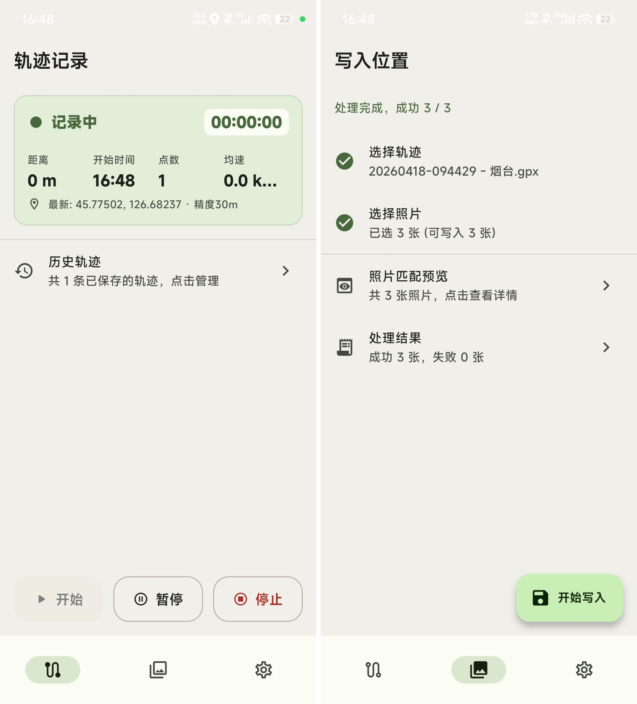

# TrackWrite

`TrackWrite` 是一个面向摄影用户的 Android 工具应用，用来记录位置信息并写入照片。

它主要解决这样一类场景：

- 照片本身没有 GPS，而相机app虽然有记录位置功能但经常断连，大部分照片未被记录上位置
- 希望在手机上直接完成轨迹记录、照片匹配、位置写回，而不是回到电脑上处理

项目基于 Flutter 开发，当前目标平台为 Android，整体强调离线、本地处理、工具化体验。


## 主要功能

- 导入外部 GPX 文件
- 选择多张 JPG/JPEG 照片
- 读取照片 EXIF 时间信息
- 通过相机时间校准修正拍摄时间偏差
- 按最大时间差将照片与轨迹点匹配
- 支持将位置写回原图，或导出带定位信息的照片副本
- 支持跳过或覆盖已有 GPS 信息的照片
- 在应用内记录轨迹，并保存历史轨迹
- 支持将应用内轨迹直接用于照片写入
- 支持导出和分享已记录的 GPX 轨迹

## 当前界面结构

应用当前包含 3 个主要页面：

- `轨迹记录`
  用于请求定位权限、开始/暂停/停止记录轨迹，并管理历史轨迹
- `写入位置`
  用于选择轨迹、选择照片、预览匹配结果并批量写入位置
- `工具设置`
  用于调整记录频率、时间校准、最大时间差、写入方式、导出位置、外观等设置

## 使用流程

### 方式一：导入外部轨迹后写入照片

1. 在 `写入位置` 页面选择外部 GPX 文件
2. 选择需要处理的 JPG 照片
3. 根据需要调整 `相机时间校准` 和 `允许的最大时间差`
4. 确认写入方式
5. 预览匹配结果后执行写入

### 方式二：先在 app 内记录轨迹，再用于写入

1. 在 `轨迹记录` 页面授予定位权限
2. 开始记录轨迹
3. 结束后保存轨迹到历史列表
4. 在历史轨迹里选择 `用于照片写入`
5. 跳转到 `写入位置` 页面继续处理照片

## 权限与系统行为

应用当前主要依赖以下 Android 能力：

- 前台定位权限
- 后台定位权限
- 系统定位服务
- 文档/媒体选择器返回的照片读写授权

说明：

- 首次进入应用时会尝试申请前台定位权限
- 后台定位通常需要在系统权限页面中进一步开启
- 当系统定位服务关闭时，应用会引导用户跳转到系统定位设置
- 照片写入优先使用系统选择器返回的可写 URI，避免不必要的文件权限申请


## 项目结构

```text
lib/
  main.dart                  应用入口
  screens/                   页面
  state/                     状态控制器
  services/                  GPX、EXIF、定位、导出等服务
  models/                    数据模型
  repositories/              本地数据存储

android/
  app/src/main/kotlin/       Android 原生实现

docs/
  ANDROID_STUDIO_RUN.md      Android Studio 运行说明
```

## 本地开发

安装依赖：

```bash
flutter pub get
```

运行应用：

```bash
flutter run
```

静态检查：

```bash
flutter analyze
```

运行测试：

```bash
flutter test
```

构建 Android 安装包：

```bash
flutter build apk --release --split-per-abi
```

如果用于正式分发，建议构建 `AAB`：

```bash
flutter build appbundle --release
```

